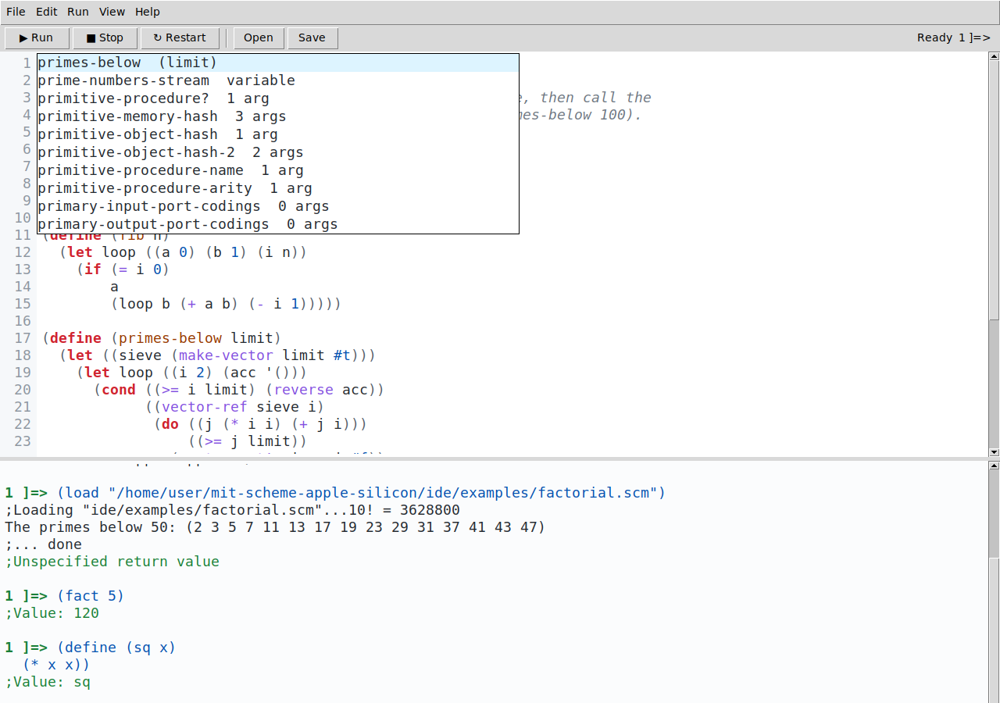

# MIT Scheme IDE

A small desktop IDE for MIT/GNU Scheme: a source editor with syntax
highlighting and code completion on top, an interactive console below,
and a Run button that loads the buffer into the running interpreter.

It is a single Python file that needs only the standard library (with
Tk) and an `mit-scheme` binary. No packages to install, nothing to build.



```sh
python3 ide/mit_scheme_ide.py                 # empty buffer
python3 ide/mit_scheme_ide.py program.scm     # open a file
python3 ide/mit_scheme_ide.py -- --heap 100000  # pass options to mit-scheme
```

## Requirements

- **Python 3.8+ with tkinter.** The python.org macOS installer bundles
  Tk. Homebrew's Python needs `brew install python-tk`; Debian/Ubuntu
  need `apt install python3-tk`.
- **An MIT/GNU Scheme binary**, for example the
  [Apple Silicon release](https://github.com/mjchaker/mit-scheme-apple-silicon/releases)
  of this repository. The IDE looks for it in this order:
  1. `--scheme PATH` on the command line
  2. the `MIT_SCHEME_EXE` environment variable (the same variable the
     build uses)
  3. the interpreter chosen with *Run → Choose Interpreter…* last time
  4. `mit-scheme` on `$PATH`
  5. a freshly built in-tree `src/run-build` next to this directory
  6. `~/opt/mit-scheme/bin/mit-scheme`, Homebrew and MacPorts prefixes,
     `/Applications/mit-scheme*/bin/mit-scheme`

macOS and Linux are supported. Windows is not: the console driver relies
on POSIX signals to interrupt the interpreter.

## What it does

**Run.** *▶ Run* (`⌘R` / `Ctrl+R` / `F5`) saves the buffer and sends
`(load "file")` to the console, so definitions land in the REPL and you
can call them interactively afterwards. An unsaved buffer is loaded from
a temporary file. `⌘↩` sends the selection, or the top-level definition
around the cursor, without saving anything.

**Console.** A real MIT Scheme REPL, driven through the interpreter's
`--emacs` interface (the protocol `xscheme.el` uses). Because Scheme
reports its prompt, values, errors and garbage collections out of band,
the console always knows the REPL level (`1 ]=>`, `2 error>`,
`3 debug>`), shows *Ready / Evaluating… / Garbage collecting…* in the
toolbar, and colours values and error messages. Enter sends the input
once its parentheses balance; before that it inserts an indented
continuation line (`⇧↩` sends regardless). `↑`/`↓` on the first/last line
recall history. Programs that read from the console, e.g. `(read-line)`,
take their input from the same place you type expressions.

**Stop.** *■ Stop* (`⌘.` on macOS, `Ctrl+C` in the console elsewhere)
delivers the `^G` interrupt: the running evaluation is aborted and the
REPL returns to top level. *↻ Restart* kills the interpreter and starts a
fresh one.

**Editor.** Syntax highlighting for comments (including nested `#| |#`
blocks and `#;` datum comments), strings, characters, numbers, `#t`/`#f`
and `#!` objects, quoted symbols, special forms, and the name being
defined. Procedures and macros that are bound in the running interpreter
are coloured too, so a typo in a builtin name stands out. Matching
parentheses are highlighted, unmatched ones marked. Enter auto-indents in
the style of Emacs's `scheme-mode`; Tab re-indents the current line (or
the selected lines); `⌘/` comments and uncomments; `⌘F` finds. Line
numbers, undo/redo, light and dark themes.

**Completion.** `Ctrl+Space` (or Tab at the end of a word, or just
typing when *Complete While Typing* is on) opens a list of candidates.
The list comes from the live interpreter: at startup, and again after
every evaluation, the IDE silently evaluates an expression in the REPL
that writes out every name bound in the REPL environment chain together
with its kind and lambda list, so your own `define`s complete with their
parameter names moments after you evaluate them. On a normal install the
runtime ships its debugging info (`.bci` files), so builtins show their
real parameter lists as well, e.g. `string-pad-left  (string n #!optional char)`;
without that info the arity is shown instead. Names that only exist in
the editor buffer are offered too. The status bar shows the signature of
the call the cursor is in.

## Keyboard reference

| Action | macOS | Linux |
| --- | --- | --- |
| Run buffer | `⌘R`, `F5` | `Ctrl+R`, `F5` |
| Send selection / definition at cursor | `⌘↩` | `Ctrl+↩` |
| Load a file into the REPL | `⇧⌘L` | `Ctrl+Shift+L` |
| Interrupt (`^G`) | `⌘.` | `Ctrl+C` in the console |
| Restart Scheme | `⇧⌘R` | `Ctrl+Shift+R` |
| Clear console | `⌘K` | `Ctrl+K` |
| Complete symbol | `Ctrl+Space`, `Tab` | `Ctrl+Space`, `Tab` |
| Re-indent line / region | `Tab` | `Tab` |
| Comment / uncomment | `⌘/` | `Ctrl+/` |
| Find, find next | `⌘F`, `⌘G` | `Ctrl+F`, `Ctrl+G` |
| Focus editor / console | `⌘1` / `⌘2` | `Ctrl+1` / `Ctrl+2` |
| Text size | `⌘=`, `⌘-`, `⌘0` | `Ctrl+=`, `Ctrl+-`, `Ctrl+0` |

*Help → Keyboard Shortcuts* shows the same list inside the app.

Preferences (interpreter, font size, theme, window layout, recent files)
are kept in `~/Library/Application Support/mit-scheme-ide/prefs.json` on
macOS and `$XDG_CONFIG_HOME/mit-scheme-ide/prefs.json` elsewhere.

## How the pieces fit

Everything lives in `mit_scheme_ide.py`. The top half is GUI-free and
unit-tested:

- `EmacsProtocolParser` turns the byte stream of `mit-scheme --emacs`
  into events (`prompt`, `ready`, `value`, `error`, `gc-start`, …). The
  protocol is defined by `src/runtime/emacs.scm` and consumed by
  `etc/xscheme.el`.
- `SchemeProcess` runs the interpreter behind pipes with a reader and a
  writer thread and implements the interrupt handshake (`SIGINT`, then a
  NUL byte, as xscheme does).
- `tokenize` is the lexer behind highlighting, paren matching,
  `is_complete_input`, and `compute_indent`.
- `CompletionIndex` holds the per-environment dumps produced by
  `DUMP_EXPRESSION` (the Scheme code evaluated invisibly in the REPL)
  plus the names found in the editor.

The bottom half is the Tk application: `Editor`, `Console`, the shared
`CompletionPopup`, and `IDE`, which owns the process and turns protocol
events into console output. An invisible evaluation is only ever sent
while the REPL is idle; anything you type in the meantime is queued and
sent right after it, so ordering is preserved.

## Tests

```sh
python3 -m unittest discover -s ide/tests -v
```

The last test class drives a real interpreter through the same code the
GUI uses (evaluation, errors and restarts, interrupts, loading a file,
the completion dump); it is skipped when no `mit-scheme` is found.

## Known limits

- One buffer at a time. Open another file and the current one is
  replaced (you are asked to save first).
- The debugger (`(debug)`, `2 error>` commands such as `(restart 1)`)
  works because it is just the REPL, but there is no graphical stack
  view.
- Highlighting re-tokenizes the whole buffer after each edit. That is
  instantaneous for files of a few thousand lines and noticeable beyond
  a few hundred kilobytes.
